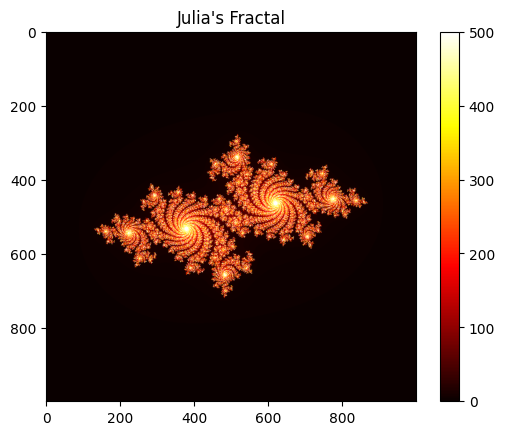

# Julia Fractals Generator


---

## Project Description
This project focuses on the generation and analysis of **Julia fractals** using computational algorithms implemented in Python.

Julia fractals are complex mathematical structures that emerge from the iteration of functions in the complex plane. They are characterized by their **self-similarity**, meaning that smaller portions of the fractal resemble the overall structure.

The main goal of this project is to develop an algorithm capable of generating visual representations of Julia sets and analyzing their behavior based on different parameters.

---

## Problem Statement
The problem consists of generating the Julia set using the iterative function:

`z(n+1) = z(n)^2 + c`

Where:
- z is a complex number  
- c is a constant complex parameter  

For each point in the complex plane, the algorithm determines whether the sequence converges or diverges, which defines if the point belongs to the fractal.

---

## Methodology
To solve the problem, the following approach was implemented:

1. Define a grid of points over the complex plane  
2. Apply the iterative function to each point  
3. Check whether the sequence diverges beyond a threshold  
4. Record the number of iterations required  
5. Store the results in a matrix for visualization  

Additionally, performance tests were conducted by varying:
- Maximum number of iterations  
- Image resolution (width and height)  

---

## Results
- Successfully generated visual representations of Julia fractals  
- Observed how different values of c significantly affect the fractal shape  
- Verified that execution time increases with the number of iterations  
- Performed an empirical analysis of the algorithm’s behavior  

---

## Technologies Used
- **Python** → Main programming language  
- **NumPy** → Numerical computations and array handling  
- **Matplotlib** → Fractal visualization  
- **Time** → Execution time measurement  

---

## Algorithm Analysis
The time complexity of the algorithm can be approximated as:

`O(n · m · k)`

Where:
- n: image width  
- m: image height  
- k: maximum number of iterations  

This shows that execution time grows proportionally with the number of evaluated points and iterations per point.

---

## Output Example
The program generates images representing the Julia fractal, where colors indicate how quickly each point diverges.



---

## Conclusions
- Julia fractals demonstrate how complex patterns arise from simple mathematical rules  
- Computational implementation allows deeper exploration of dynamical systems  
- Algorithm performance depends directly on resolution and iteration limits  
- A scalable and efficient solution for fractal generation was achieved  

---

## How to Run 
1. Clone the repository: 
```bash
git clone https://github.com/Mitin726/Julia-s-Fractal-Generator-Algorithm
```
2. Navigate to the project directory:
```bash
cd Julia-s-Fractal-Generator-Algorithm
```
3. Install dependencies:
```bash
pip install numpy matplotlib
```
4. Run the program:
```bash  
python algorithmJulia.py
```

Made with ❤️ by Mitin726